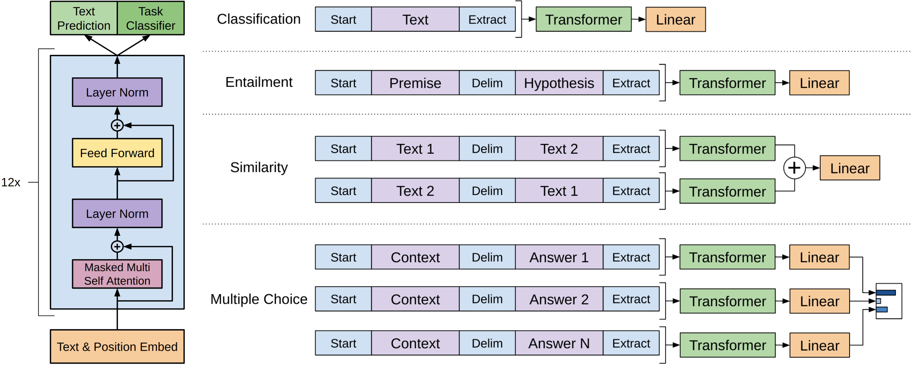

# GPT: Improving Language Understanding by Generative Pre-Training

[2018 OpenAI: Improving Language Understanding by Generative Pre-Training](https://cdn.openai.com/research-covers/language-unsupervised/language_understanding_paper.pdf)

<blockquote>

$$
\begin{align*}\text{semi-supervised learning} &= \text{ unsupervised pre-training + supervised fine-tuning} \\ &= \text{self-supervised learning}\end{align*}
$$

</blockquote>

## Introduction

Although large unlabeled text corpora are abundant, labeled data for learning these specific tasks is scarce, making it challenging for discriminatively trained models to perform adequately. To address this, OpenAI team train a large language model on a generic corpus (**generative pre-training**) and then fine-tune it to specific tasks (**discriminative fine-tuning**) to leverage the labeled data efficiently. However, despite becoming a mainstream method in computer vision (CV) approximately 10 years ago, it had not yet gained widespread usage in natural language processing (NLP). This can be attributed to the absence of high-quality, large-scale datasets comparable to ImageNet in the field of NLP.

**Nonetheless, leveraging information from unlabeled text poses significant challenges.** Firstly, a significant challenge lies in determining the optimal optimization objective for pre-training. Secondly, we don't know how to effectively transfer these learned representations to the target subtasks. This challenge arises from the inherent diversity among subtasks in NLP, where they often differ significantly from each other. Consequently, the pre-training representations may not seamlessly align with all subtasks.

Therefore, OpenAI has proposed **semi-supervised learning**, which is now commonly referred to as self-supervised learning. Firstly, they employ a language modeling objective on the unlabeled data to initially train the parameters of a neural network model. Following this, the parameters are further fine-tuned for a specific target task using the corresponding supervised objective.

## Framework

### Unsupervised Pre-training

GPT utilizes an objective function derived from a standard language model. Specifically, it maximizes the log-likelihood of predicting the next token in a sequence based on the previous tokens. Assume we have corpus of tokens $\mathcal{U} = \lbrace u_1, \cdots, u_n \rbrace$, the objective function is:

$$
\mathcal{L}_{\text{LM}}(\mathcal{U}) = \sum_{i=1}^{n} \log P(u_i \vert u_{i-k}, \cdots, u_{i-1}; \Theta) \tag{1}
$$

where the hyper-parameter $k$ is the context size and $\Theta$ is the model parameters. The model is trained by stochastic gradient descent (SGD) to maximize the objective function.

GPT uses a multi-layer **Transformer decoder** for the language model. Recall that Transformer consists of a encoder and a decoder. The **main distinction** between the two lies in their utilization of information from the input sequence. The encoder can access the entire sequence when encoding the $i$-th token, whereas the decoder can only rely on information from the previous tokens due to masking. As the language model's objective is to predict the next token, only the decoder component can be utilized. The process follows:

$$
\begin{align*}
h_0 &= \text{Embedding}(u_{i-k}, \cdots, u_{i-1}) = \mathbf{UW}_e + \mathbf{W}_p\\
h_l &= \text{Transformer\_Block}(h_{i-1}, u_{i-1}) \quad \forall l \in [1, n]\\
P(u_i \vert u_{i-k}, \cdots, u_{i-1}; \Theta) &= \text{Softmax}(h_l \mathbf{W}^\top_e)
\end{align*} \tag{2}
$$

where $\mathbf{U} = (u_{i-k}, \cdots, u_{i-1})$ is the context vector of tokens, $\mathbf{W}_e$ is the token embedding matrix, $\mathbf{W}_p$ is the positional embedding matrix.

In contrast to GPT, BERT uses a **Transformer encoder** for the language model. BERT doesn't use a standard language model. When training BERT, a token in a sentence is masked, and the task is to predict the masked token. This allows the model to utilize both the preceding and following tokens, enabling bidirectional context understanding.

However the main difference between GPT and BERT doesn't lie in the selection of the decoder and encoder, but lies in the selection of the objective function. GPT opts for a more challenging objective function, which involves predicting the next token in a sequence. On the countrary, BERT adopts a relatively easier objective function, which entails predicting the masked token. It is widely acknowledged that predicting future tokens is considerably more difficult than predicting masked tokens from the past. (Insert a Example Here) Predicting an open ending is much harder than predicting an intermediate state. This observation could explain why BERT was considered more powerful than GPT at the time. **However, it is worth noting that if a model is truely capable of accurately predicting future tokens, it inherently possesses greater power compared to a model trained solely on predicting intermediate states.** Maybe this realization has motivated the OpenAI team to continually increase the number of parameters in GPT, aiming to enhance its predictive capabilities instead of choosing to use the encoder. So, now, the amazing effect of GPT-3 proves that the choice of OpenAI is correct.

### Supervised Fine-tuning

After pre-training on a large unlabeled corpus, the model is fine-tuned on a relatively small labeled dataset for a specific task. We assume a labeled dataset $\mathcal{C}$, where each example $(\mathbf{x}, y)$ consists of an input sequence $\mathbf{x}$ and its corresponding label $y$. The input sequence $\mathbf{x}$ is represented as a sequence of tokens $\mathbf{x} = (x^1, \cdots, x^m)$. The input are passed through our pre-trained model to obtain the **final** transformer block's activation $h_l^m$, which is then fed into an added **linear output layer** with parameters $\mathbf{W}_y$ to predict $y$:

$$
P(y \vert \mathbf{x}) = \text{Softmax}(h_l^m \mathbf{W}^\top_y) \tag{3}
$$

This gives us the following objective function, i.e., the log-likelihood of the correct label:

$$
\mathcal{L}_{\text{FT}}(\mathcal{C}) = \sum_{(\mathbf{x}, y) \in \mathcal{C}} \log P(y \vert \mathbf{x}) \tag{4}
$$

By incorporating the language modeling loss $$\mathcal{L}_{\text{LM}}$$ as an auxiliary objective during the fine-tuning process, the supervised model can benefit in several ways. Firstly, it enhances the model's generalization ability, enabling it to perform better on unseen data. Secondly, the inclusion of $$\mathcal{L}_{\text{LM}}$$ helps expedite the convergence of the model during training, leading to faster overall progress.

$$
\mathcal{L}_{\text{FT}}(\mathcal{C}) = \mathcal{L}_{\text{FT}}(\mathcal{C}) + \lambda \mathcal{L}_{\text{LM}}(\mathcal{C}) \tag{5}
$$

where $\lambda$ is a hyper-parameter that controls the relative importance of the two objectives.

### Task-specific Input Transformations

<figure>
    
    <figcaption style="font-size:10pt">Figure 1: <i><b>(left)</b> Transformer architecture and training objectives used in this work. <b>(right)</b> Input transformations for fine-tuning on different tasks. We convert all structured inputs into token sequences to be processed by our pre-trained model, followed by a linear+softmax layer.</i></figcaption>
</figure>

For different tasks, we need to transform the original input seqence by adding some special tokens. 

For example,

1. **Classification**: Convert the input into a sequence of tokens by adding a special token `[Start]` at the beginning of the input and a special token `[Extract]` at the end of the input. Then the input passes through the pre-trained Transformer and then the linear layer to get the logits, which is then calculated by the sigmoid function to get the probability of the positive class.
2. **Similarity**: There is a semantic difference between `Text 1` being similar to `Text 2` and `Text 2` being similar to `Text 1`. Therefore, we need to construct two new seqences, one is `[Start] Text 1 [Delim] Text 2 [Extract]`, the other is `[Start] Text 2 [Delim] Text 1 [Extract]`. Then we sum (or concate) the representations of the two sequences and use a linear layer to calculate the logits. 
3. **Multiple Choice**: We need to construct a new sequence for each choice: `[Start] Question [Delim] Choice i [Extract]`. Each new sequence for each choice is fed into the pre-trained Transformer to obtain the representation, which is then fed into a linear layer to calculate the logits. At the end, use a softmax layer to calculate the probability of each choice.

Only after several months, Google introduced its own language model called BERT, which proved to be a significant development. In comparison to GPT, BERT-large boasts a substantially higher number of parameters and achieves superior performance across various NLP tasks. Even BERT-base, which has a similar scale of parameters as GPT, exhibits better performance than GPT in most cases. This underscores the effectiveness of BERT's architecture and its ability to excel in a wide range of NLP applications. Indeed, BERT's introduction had a significant impact and garnered considerable attention within the field of NLP. Its success demonstrated the potential and promise of language models based on the **Transformer encoder** architecture. 

The "arms race" between Google and OpenAI kicked off. A few months later, GPT-2 debuted.