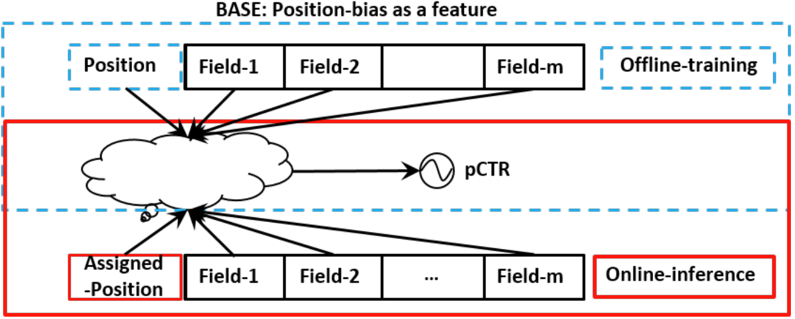
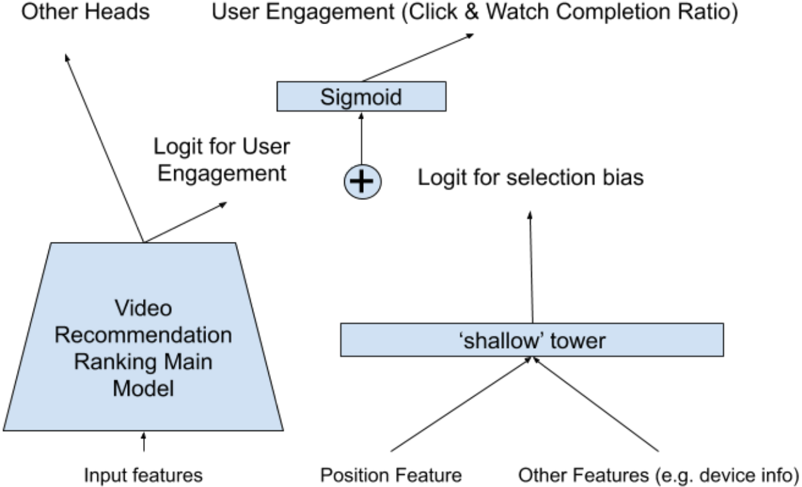
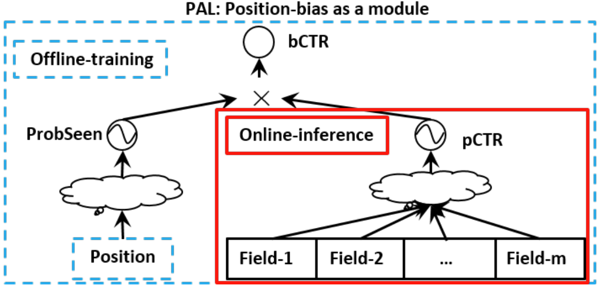

# De Position Bias
## Background
Ideally, we want users' click behavior to reflect their actual preferences. However, in reality, their click behavior is often influenced by various factors such as position, freshness, and popularity. These factors introduce bias, causing users' click behavior to deviate from their actual preferences. For instance, if a user doesn't click on an item, it doesn't necessarily mean that they don't like it. Similarly, if a user clicks on an item, it doesn't necessarily mean that they like it. Bias reduces the accuracy of recommendation systems, so debiasing the data is necessary to improve system performance.

In this paper, I will introduce the methods I used to debias position bias while working at ByteDance. Debiasing is always a challenging problem in the industry, as it is difficult to evaluate the performance of debiasing algorithms.

### Position Bias
Position bias is the most common bias in recommendation systems. It occurs because users are more likely to click on items that are displayed in a prominent position. Our investigation reveals that even when two items have the same ranking score, the item in the first position is more likely to be clicked. Therefore, the data we collect from the real world is biased. However, we often fail to account for this bias when training our model, resulting in a model that is biased towards the first position. To address this issue, we need to introduce a debiasing mechanism into our model.

## Debiasing Mechanism
There are three ways to introduce a debiasing mechanism into our model. The first is to use item position in each session as a feature when training the model. Since we don't know the actual position of the item when serving, we set every item's position to the same value, e.g. 0. Then, we use our model to predict scores with this dummy position.

The second approach is to model the position bias separately and only use the ranking model when serving. This method avoids the problem of the dummy position explained below.

The third approach is inverse propensity weighting (IPW)[^1].

The first approach is the simplest, but it has a major problem. The position feature will inevitably interfere with the model's learning of other features due to its interaction with them during training of the NN model. Therefore, if we mask the position feature during serving, the cross feature will differ from the training phase and affect the model's performance. That's why I prefer to use a separate shallow tower to model the position bias.

To analyze the effect of position, it would be convenient to decouple the position bias from the ranking model. To achieve this, we use a shallow tower which avoids over-generalization and increases memory capacity, which is a key concept of the Wide&Deep[^2] structure.

### YouTube[^3]

The figure on the right illustrates the structure of YouTube's debiasing mechanism. The position bias is modeled by a shallow tower, which consists of a fully connected layer with a sigmoid activation function. The input of the shallow tower is the position of the item in the session, and its output is the position bias.

The ranking model is a deep tower that takes the user's click history and the candidate item's features as inputs. **The output of the deep tower is the ranking score, which is combined with the position bias to obtain the final score.** The final score is used to rank the items.

### HuaWei: PAL[^4]

The main difference between PAL and YouTube is that PAL **multiplies** the position bias with the ranking score instead of adding them together. 

Our model is similar to PAL. The ranking model aligns with the online model that we were using. The position bias is modeled by a simple shallow tower, which is a single-layer neural network.

To implement this shallow model, I need to introduce a new feature: the absolute position of an item in a session. The absolute position is the position of an item in the entire session. For example, if a session contains 10 items, the absolute position of the first item is 1, and the absolute position of the last item is 10. The absolute position serves as the input of the shallow tower.

The output of the shallow tower is the representation of the position bias. This position bias is then multiplied with the ranking score to obtain the final score:

$$
{\rm final\_score = ranking\_score \times position\_bias} = {\rm DNN}(u, t) \times w^\top b
$$

where $\rm DNN$ is the ranking model, $u$ is the user's features, $t$ is the candidate item's features, $w$ is the weight of the shallow tower, and $b$ is the position bias.

(Todo: the difference between relative position and absolute position).

## Conclusion
The experiment was conducted on the Douyin (TikTok) live broadcast. This model resulted in an average increase of 0.2% in viewing time and a 0.18% increase in CTR UAUC.

Debiasing is not without its challenges. Firstly, our understanding of bias may be flawed. Secondly, our debiasing approach cannot guarantee complete removal of bias; in fact, it may even introduce new biases. These points should be considered when designing debiasing algorithms from the outset.

Earning short-term indicators is certainly challenging, but it can greatly benefit the long-term health of the recommendation system's ecology.

---

[^1]: [Unbiased Learning to Rank with Unbiased Propensity Estimation](https://arxiv.org/pdf/1804.05938.pdf)

[^2]: [Wide & Deep Learning for Recommender Systems](https://arxiv.org/pdf/1606.07792.pdf)

[^3]: [Recommending What Video to Watch Next: A Multitask Ranking System](https://daiwk.github.io/assets/youtube-multitask.pdf)

[^4]: [PAL: a position-bias aware learning framework for CTR prediction in live recommender systems](https://dl.acm.org/doi/10.1145/3298689.3347033)
