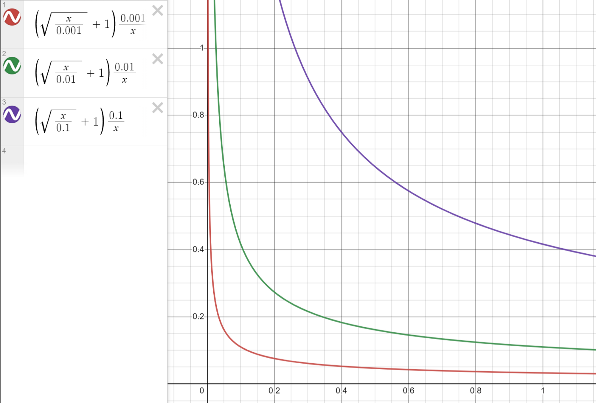

# Negative Sampling
In the ranking stage, we can often see many kinds of exquisite models, and the recall model is often simple. This is because the order of magnitude of samples processed in the ranking stage is much smaller than that in the recall stage. Therefore, how to select samples in the recall phase has become a top priority. How choose the negative samples is a key issue in the recall phase.

In Facebook's search[^1], they states that we cannot use non-click impressions as negative samples. The model trained using non-click impressions as negative has significantly worse model recall compared to using random negative: absolute 55% regression in recall for people embedding model. This seems to be contrary to the ideas of some colleagues. "Non-click impressions" contains several straightforward properties that could be quite useful:

- Compared to random sampling, non-click impressions are more likely to be the items that the user is not interested in.
- The scale of non-click impressions is much smaller, which is more faster to process.

Yes. It may reach to a better performance in offline-training when using non-click impressions samples to be negative smaples. However, in the online stage, the model recall is significantly worse. **The key reason is: the data distributino of offlin-training doesn't align with the online stage. The offline data distribution should always be the same with the online data distribution.** These non-click impressions (hard cases) are the items that successfully pass through the recall and cascade stages and ultimately get displayed to the user. Therefore, they might match the query in one or multiple factors, while the majority of items (easy cases) in the online environment do not match the query at all. Having all negatives being such hard negatives will change the representativeness of the training data to the real retrieval task, which might impose non-trivial bias to the learned embeddings.[^1]
## Random Sampling

Based on the above analysis, Facebook uses ***random sampling*** as negative samples. Since most items are not relevant to the query at all when serving, random sampling simulates the online data distribution well. However, it is not reasonable to select samples in the whole item set with same probability, since a small number of popular items account for the vast majority of impressions and clicks.[^2]

Therefore, when selecting positive samples, we need to downsample, i.e., reduce the probability of sampling popular items:

$$
p_i^+ = \left(\sqrt{\frac{z(w_i)}{a}} + 1\right) \frac{a}{z(w_i)}
$$

where $z(w_i)$ is the number of impressions of item $i$ in the training set. As shown in the figure, the smaller the hyper-parameter $a$ the more severe the suppression of the hot items.

On the countrary, when sampling negative samples, we need to upsample, i.e., increase the probability of sampling popular items. By doing this, unpopular will get more chances to be impressed. The probability of sampling negative samples could be:

$$
p_i^- = \frac{f(w_i)^b}{\sum_{j=1}^N f(w_j)^b}
$$

where $f(w_i)$ is the number of users who have clicked on item $i$ in the training set and $b$ is a hyper-parameter to control the degree of upsampling. 

Obviously, however, it is insufficient to only consider the random sampling. Using random negavtive samples will lead to the model can only learn the coarser-grained difference. For example, the model can corretly recommends video games to game lovers, but it cannot recommend the specific game to the user. Therefore, we need to consider the ***hard negative mining***.

## Hard Negative Mining

How to choose the negative samples depends on different scenarios. Airbnb[^3] select har negative samples according to its own business logic:

- Increase the negative samples that are in the same locations as the positive samples.
- Increase the negative samples that are rejected by hosts.

However, not all business logic can have a clear signal. In this case, we can only use model to mine the hard negative samples. That is to use the previous version of the recall model to filter out "not so similar" <user, item> pairs as additional negative samples to train the next version of the recall model. In Facebook's search[^1], they use the following method to mine the hard negative samples offline:

1. generate top $K$ results for each query.
2. select hard negatives based on *hard selection strategy*.
3. retrain embedding model using the newly generated hard triplets.
4. the procedure can be iterative.

Instead of using the hardest examples, they found sampling between rank 101-500 achieved the best model recall. Different from the offline stage that the candidate pool is the whole item set, in the online stage, the candidate pool is ohter the set contains the positive samples of other users in the same mini-batch.

Note that the hard negative samples is only the supplement of the easy negative samples. 

## Are non-click impressions entirely useless?
Todo

---

[^1]: [Embedding-based Retrieval in Facebook Search](https://arxiv.org/pdf/2006.11632.pdf)

[^2]: [负样本为王](https://zhuanlan.zhihu.com/p/165064102)

[^3]: [Real-time Personalization using Embeddings for Search Ranking at Airbnb](https://dl.acm.org/doi/pdf/10.1145/3219819.3219885)