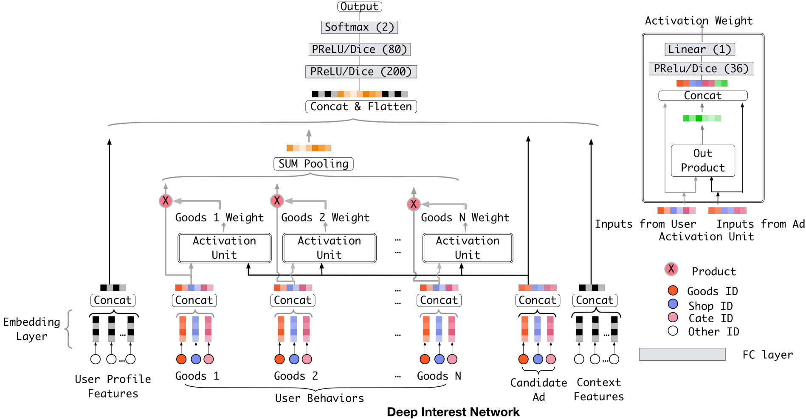
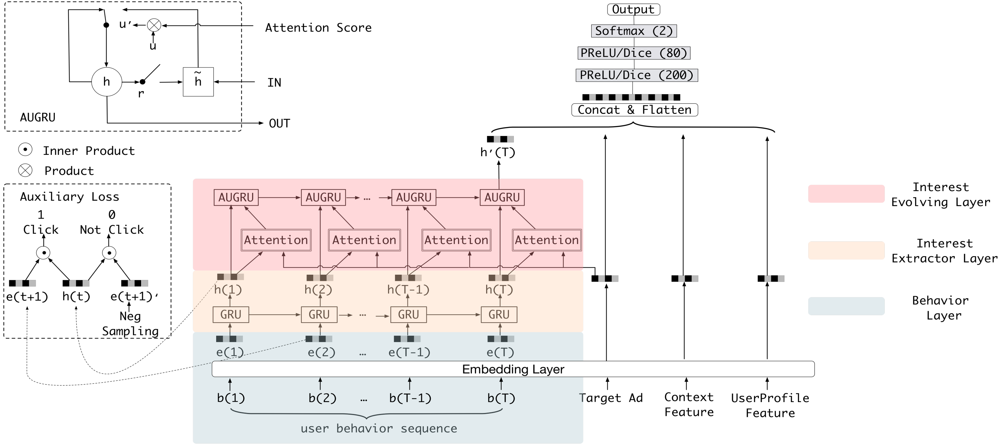
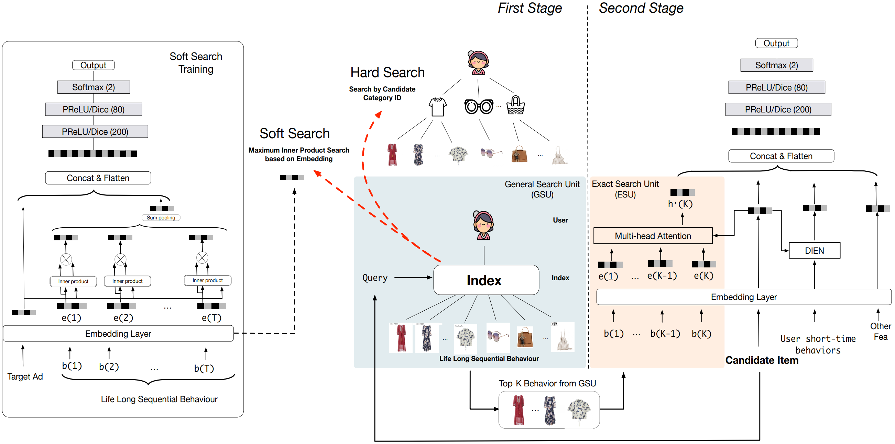

# Ranking Models: User Behavior Sequence Modeling
## Introduction

Traditional recommendation systems only have the ability to capture general user preferences and represent user-item interaction in a static way. In reality, however, the user interests in recommendation systems are dynamic in nature with a strong correlation and even causality between the actions of users, i.e., how previous behaviors affect subsequent behaviors. Moreover, users always have multiple interests, and the importance of these interests not only varies through time but also depends on the candidate items. For example, a user may be interested in both sports and music, but the user's interest in sports may be more important when the user is browsing sports news, while the user's interest in music may be more important when the user is browsing music news. There are so many valuable features in the user behavior sequence that can be used to improve the performance of the recommendation system. As a result, the industry faces a new challenge: how to model a user behavior sequence. 

## Attention-based Models

Attention is one of the most widely used mechanisms in deep learning. It was first proposed in the field of natural language processing (NLP) and has been widely used in many fields such as computer vision and recommendation systems. The standard attention is defined as:

$$
\begin{align*}
    {\rm Attention}(\mathbf{Q, K, V}) = {\rm softmax}(\frac{\mathbf{QK}^T}{\sqrt{d_k}}){\mathbf{V}}
\end{align*}
$$

here $\mathbf{Q}$ is the query vector, $\mathbf{K}$ is the key vectors, $\mathbf{V}$ is the value vectors, and $d_k$ is the dimension of the key vectors. Specifically, self-attention uses the same objects as queries, keys, and values. In self-attention, the model assigns a weight to each input element and uses these weights to calculate a weighted sum of the input elements. The weights are learned during training and are used to determine which input elements are most relevant to the task.

The introduction of the **attention score** reflects the natural **attention mechanism** characteristic of humans. The simulation of this mechanism allows recommendation systems to be closer to the real thinking process of a user, i.e., "paying attention" to certain parts of the input when making decisions, thus improving the effectiveness of recommendations.

In 2017, Attentional Factorization Machines (AFM) introduced the attention mechanism to the traditional recommendation model FM. In August 2018, Kang and McAuley released Self-Attentive Sequential Recommendation model (SASRec). In September of the same year, Zhou et al. proposed **Deep Interest Network (DIN)**. Both models are deep learning-based, incorporating the attention mechanism. Compared with the FM-based AFM model, the DIN model is a more typical attempt to improve deep learning networks, and it also gives more substantial inspiration to recommendation engineers because the starting point is a specific business scenario.

### Deep Interest Network (DIN) [^1]

<figure>
    
    <figcaption>Figure1: <i>Deep Interest Network (DIN)</i></figcaption>
</figure>

One limitation observed in traditional CTR prediction models like FM (Factorization Machines), CF (Collaborative Filtering), and the YouTube model is their tendency to map the sequence of a user's historical behavior to a fixed-length vector regardless of the candidate items. This approach significantly restricts the expressiveness of the features. To address this issue, the DIN will evaluate the similarity between a user historical behavior sequence with different candidate objects via attention mechanism, and then it will extract various interest features in an adaptive manner.

### Deep Interest Evolution Network (DIEN) [^2]

<figure>
    
    <figcaption>Figure2: <i>Deep Interest Evolution Network (DIEN)</i></figcaption>
</figure>

After DIN was proposed, Zhou et al. released its upgraded version, **Deep Interest Evolution Network (DIEN)**, in 2019. The innovation lies in the use of a sequence model **AUGRU (GRU with attentional update gate)** to simulate the evolution of users' interests. Both AFM and DIN simply score the relevance of different actions, such that the scores are time-independent, or sequence-independent. However, models will be less effective at learning about time and trends if sequential information is removed. Instead of recommending for "next behavior," the recommendation model would continue to be based on an analysis of all the user's past behavior. This is the flaw that was emphasised as having to be fixed in the earlier section.

To be specific, as shown in figure, the key components of the model are the **interest extractor layer**, which generates interest, and the **interest evolving layer**, which simulates interest evolution, between the embedding layer and the concatenate layer. The interest extractor layer uses the structure of DIN to extract the interests of users at each time $t$, while the interest evolving layer uses the structure of the sequence model AUGRU to link the interests of users at different times to form a chain of interest evolution. The interest vector at the current moment is then fed into the upper layer of the multi-layer fully-connected network, together with other features, for the final CTR prediction.
### Search-based User Interest Modelling (SIM) [^3]

<figure>
    
    <figcaption>Figure3: <i>Search-based User Interest Modelling (SIM)</i></figcaption>
</figure>

Industry experts are gradually coming to the consensus that **the more detailed (long) the user behavior data, the more useful it is for model prediction**. Because if the modeled sequence is too short, it will inevitably contain some impromptu behaviors of the user, which can be regarded as a kind of **noise**. In addition, too short behavior sequences cannot reflect some **periodic behaviors** of users, such as weekly and monthly habitual purchases.

Notwithstanding, longer user historical behavior sequences provide more information for user interest modeling, but they place a significant load on an online serving system's latency and storage. Consequently, the majority of proposed techniques can only model sequential user behavior data with length scaling up to hundreds. To tackle this problem, Pi et al. designed a new modeling paradigm called **search-based user interest modeling (SIM)** based on DIEN in 2020. It extends the maximum length for modeling user behavior sequences up to $54,000$, which is significant increase over multi-channel user interest memory metwork (MIMN), the released state-of-the-art industry solution for this work in 2020.

To solve the performance problem caused by very long user behavior sequences, SIM divides the search of the full sequence of candidate items into two phases, namely **GSU (General Search Unit)** and **ESU (Exact Search Unit)**. 

Pi et al. indicate that **only some user behaviors, given a certain candidate item, are valuable.** The final user decision is closely tied to this portion of the user's past actions. In the first stage, as shown in the Figure 3, GSU picks out these relative user behaviors to reduce the number of user historical behaviors that need to be processed. In the second stage, ESU uses multi-head attention to extract users' varied interests. After that, it adopts the conventional Embedding & MLP paradigm, which combines with other features such as user profiles and context features as inputs.

These three models from Alibaba are important in terms of application and serve as an example of the work that has been done recently in the industry. From DIN to SIM, Alibaba has made solid and practical breakthroughs in each case, building on its previous model. The technical evolution of Alibaba's recommendation model is very informative. At present, companies like ByteDance and Kwai have developed their recommendation models based on the SIM, and have achieved significant success. However, given the large data scale in the industry, soft search requires a higher level of computing resources, which may be unacceptably expensive.

---

[^1]: [Deep Interest Network for Click-Through Rate Prediction (DIN)](https://arxiv.org/pdf/1706.06978.pdf)

[^2]: [Deep Interest Evolution Network for Click-Through Rate Prediction (DIEN)](https://arxiv.org/pdf/1809.03672.pdf)

[^3]: [Search-based User Interest Modeling with Lifelong Sequential Behavior Data for Click-Through Rate Prediction (SIM)](https://arxiv.org/pdf/2006.05639.pdf)