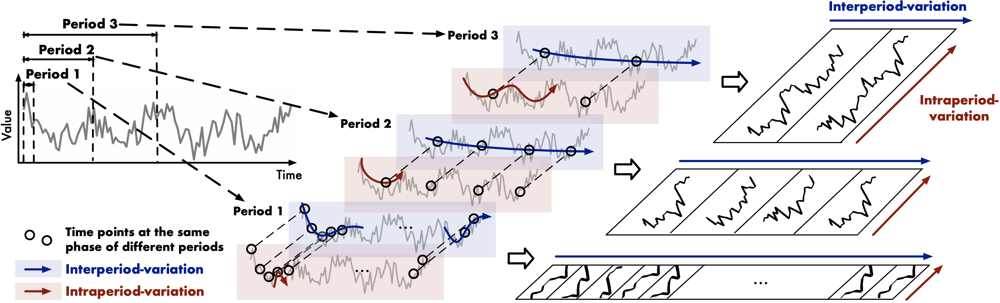
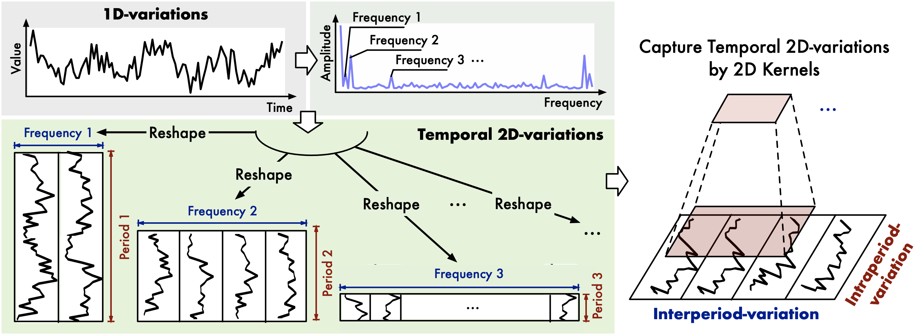
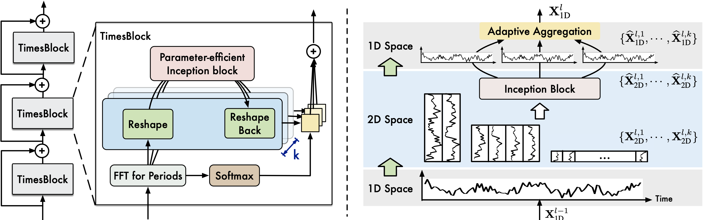

# TimesNet

## Introduction

The latest research result from the *BNRist, Tsinghua University 2023*, [***TimesNet***](https://arxiv.org/pdf/2210.02186.pdf), is a temporal 2D-variation modeling method for general time series analysis. At first glance, I immediately realized that this research perfectly aligns with my thoughts.

From my perspective, it is essential to decouple different periods within a time series. It is widely recognized that even if simple periodic functions can be integrated into an extremely chaotic waveform. Hence, the act of decoupling different periods from a time series can significantly reduce the complexity for models to handle. In addition, FFT helps us capture the variations within and between periods. This process enables the decoupled time series to possess a more distinct physical interpretation, enhancing its interpretability for both humans and algorithms.

<figure>
    
    <figcaption style="font-size:10pt">Figure 1: <i>Multi-periodicity and temporal 2D-variation of time series. Each period involves the <b>intraperiod-variation</b> and <b>interperiod-variation</b>.</i></figcaption>
</figure>

TimesNet is a general framework for time series analysis, including time series classification, time series clustering, time series forecasting, and time series anomaly detection. By transforming the 1D time series into a set of 2D tensors based on multiple periods, TimesNet breaks the limitation of the 1D time series and enables the model to capture the temporal 2D-variation of the time series.

## Methodology

### Fast Fourier Transform

Intuitively, Fast Fourier Transform (FFT) is a natural choice for decoupling different periods from a time series. 

Assume the time series is $$\mathbf{X}_{\rm 1D} = \lbrace \mathbf{x}_1, \cdots, \mathbf{x}_T\rbrace$$, where $$T$$ denotes the length of the time series. Each element $$\mathbf{x}_t$$ records $$C$$ variates. Therefore, the original 1D organization is $$\mathbf{X}_{\rm 1D} \in \mathbb{R}^{T\times C}$$. Then our first step is to extract the periodical functions from the time series:

$$
\begin{align*}
&\mathbf{A} = {\rm Avg\left(Amp\left(FFT(\mathbf{X}_{1D})\right)\right)}, \\[10pt]
&\lbrace f_1, \cdots, f_k\rbrace = \mathop{\rm argTopk}\limits_{f_\ast\in\lbrace 1, \cdots, [\frac{T}{2}]\rbrace}{(\mathbf{A})},\\
&p_i = \lceil \frac{T}{f_i} \rceil, \quad i \in \lbrace 1, \cdots, k, \rbrace \\
\end{align*} \tag{1}
$$

Here, 

1. $\rm FFT(\cdot)$ denotes the Fast Fourier Transform, and $\rm Amp(\cdot)$ denotes the amplitude of different periodical functions. 
2. $\mathbf{A} \in \mathbb{R}^{T}$ denotes the amplitude of each frequency, which is average from $C$ dimensions by $\rm Avg(\cdot)$. 
3. $\rm argTopk(\cdot)$ represents that we only select the frequencies of the top $k$ amplitudes in $\mathbf{A}$ to avoid the noises brought by meaningless high frequencies. 
4. $f_i$ denotes the frequency of the $i$-th periodical function (only consdier the frequencies withinn $\lbrace 1, \cdots, [\frac{T}{2}]\rbrace$ due to the conjugacy of frequency domain). $p_i$ denotes the period length of the $i$-th periodical function.

Summarize Equation $1$ as follows:

$$
\mathbf{A}, \lbrace f_1, \cdots, f_k\rbrace, \lbrace p_1, \cdots, p_k\rbrace = {\rm Period}(\mathbf{X}_{\rm 1D}) \tag{2}
$$

Based on the selected frequencies $\lbrace f_1, \cdots, f_k\rbrace$ and corresponding period lengths $\lbrace p_1, \cdots, p_k\rbrace$, we can reshape the 1D time series $\mathbf{X}_{\rm 1D}$ into a set of 2D tensors $$\mathbf{X}_{\rm 2D}$$:

$$
\mathbf{X}^i_{\rm 2D} = {\rm Reshape}_{p_i, f_i}({\rm Padding}(\mathbf{X}_{\rm 1D})), \quad i \in \lbrace 1, \cdots, k\rbrace \tag{3}
$$

where $$\rm Padding(\cdot)$$ is to extend the time series by zeros along temporal dimension to make it compatible for $${\rm Reshape}_{p_i, f_i}(\cdot)$$. $${\rm Reshape}_{p_i, f_i}(\cdot)$$ is to reshape the 1D time series into a 2D tensor with shape $$p_i \times f_i$$.

<figure>
    
    <figcaption style="font-size:10pt">Figure 2: <i>A univariate example to illustrate 2D structure in time series.</i></figcaption>
</figure>

Finally, we get a set of 2D tensors $$\mathbf{X}_{\rm 2D} = \lbrace \mathbf{X}^1_{\rm 2D}, \cdots, \mathbf{X}^k_{\rm 2D}\rbrace$$, where each $$\mathbf{X}^i_{\rm 2D} \in \mathbb{R}^{p_i \times f_i}$$ denotes the $$i$$-th periodical function of the time series. These 2D tensors can be easily processed by 2D kernels. 

###  TimesBlock

The section above is the pre-processing based on the FFT. After constructing the 2D tensors, now we need to extract the high-dimensional features from the 2D tensors.

<figure>
    
    <figcaption style="font-size:10pt">Figure 3: <i>Overall architecture of TimesNet.</i></figcaption>
</figure>

The core structure of TimesNet is the TimesBlock, which is designed in a residual way. First, we project the raw data $$\mathbf{X}_{\rm 1D}\in \mathbb{R}^{T\times C}$$ into the deep features $$\mathbf{X}^0_{\rm 1D} \in \mathbb{R}^{T\times d_{model}}$$ by embedding layer $$\mathbf{X}^0_{\rm 1D} = {\rm Embed}(\mathbf{X}_{1D})$$. 

For the $l$-th layer of TimesNet, the input is $$\mathbf{X}^{l-1}_{\rm 1D} \in \mathbb{R}^{T\times d_{model}}$$, and the process can be formalized as:

$$
\mathbf{X}^l_{\rm 1D} = {\rm TimesBlock}(\mathbf{X}^{l-1}_{\rm 1D}) + \mathbf{X}^{l-1}_{\rm 1D} \tag{4}
$$

TimesBlock utilizes a parameter-efficient inception block as $\rm Inception(\cdot)$ to extract the high-dimensional features from the 2D tensors. In addition to inception block, other computer vision backbones such as ResNet, ResNeXt, ConvNeXt and attention-based models can also be used as the backbone of TimesBlock, **making the time series analysis take advantages of the development of computer vison community.**. The process of capturing temporal 2D-variations is formalized as follows:

$$
\begin{align*}
\mathbf{A}^{l - 1}, \lbrace f_1, \cdots, f_k\rbrace, \lbrace p_1, \cdots, p_k\rbrace &= {\rm Period}(\mathbf{X}^{l - 1}_{\rm 1D}) \\
\mathbf{X}^{l, i}_{\rm 2D} &= {\rm Reshape}_{p_i, f_i}({\rm Padding}(\mathbf{X}^{l - 1}_{1D})), \quad i \in \lbrace 1, \cdots, k\rbrace \\
\hat{\mathbf{X}}^{l, i}_{\rm 2D} &= {\rm Inception}(\mathbf{X}^{l, i}_{\rm 2D}), \quad i \in \lbrace 1, \cdots, k\rbrace \\
\hat{\mathbf{X}}^{l, i}_{\rm 2D} &= {\rm Trunc}\left({\rm Reshape}_{1, (p_i, f_i)}(\hat{\mathbf{X}}^{l, i}_{\rm 2D})\right), \quad i \in \lbrace 1, \cdots, k\rbrace \\
\end{align*}
$$

where $${\rm Trunc}(\cdot)$$ is to truncate the padded series with length $$(p_i \times f_i)$$ into original length $$T$$.

Finally, the $$k$$ different 1D-representations $$\lbrace \hat{\mathbf{X}}^{l, 1}_{\rm 1D}, \cdots, \hat{\mathbf{X}}^{l, k}_{\rm 1D}\rbrace$$ are fused together based on the amplitudes to form the output $$\mathbf{X}^l_{\rm 1D} \in \mathbb{R}^{T\times d_{model}}$$ of the $l$-th layer of TimesNet. 

$$
\begin{align*}
    \hat{\mathbf{A}}^{l - 1}_{f_1}, \cdots, \hat{\mathbf{A}}^{l - 1}_{f_k} &= {\rm Softmax}(A^{l - 1}_{f_1}, \cdots, A^{l - 1}_{f_k}) \\
    \mathbf{X}^l_{\rm 1D} &= \sum_{i=1}^k \hat{\mathbf{A}}^{l - 1}_{f_i} \times \hat{\mathbf{X}}^{l, i}_{\rm 1D}
\end{align*}
$$

Given that the variations within and between periods are already encompassed in multiple highly-structured 2D tensors, the TimesBlock module is capable of capturing multi-scale temporal 2D variations simultaneously. As a result, TimesNet can accomplish more effective representation learning compared to learning directly from 1D time series.